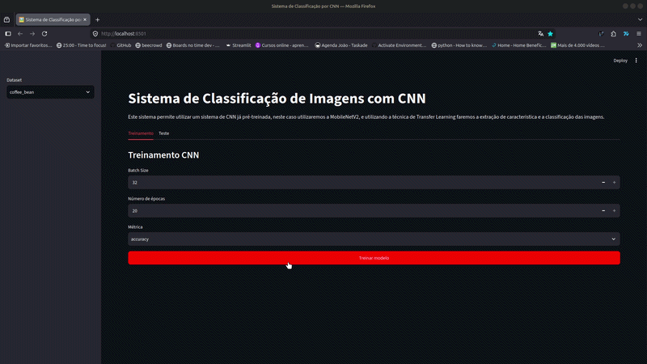
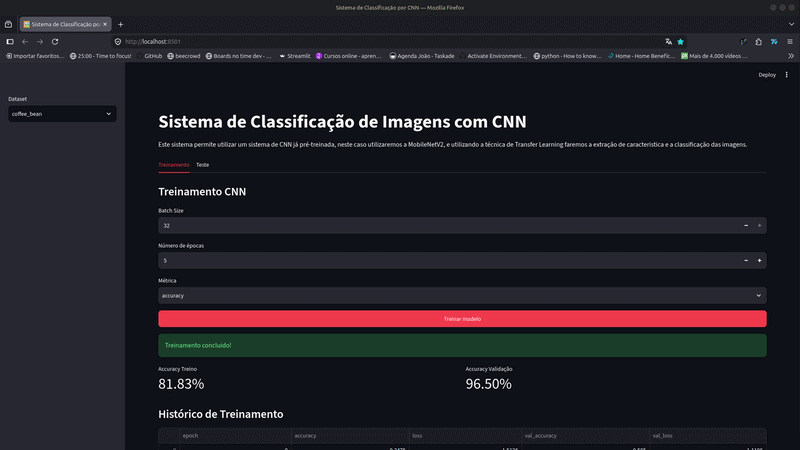
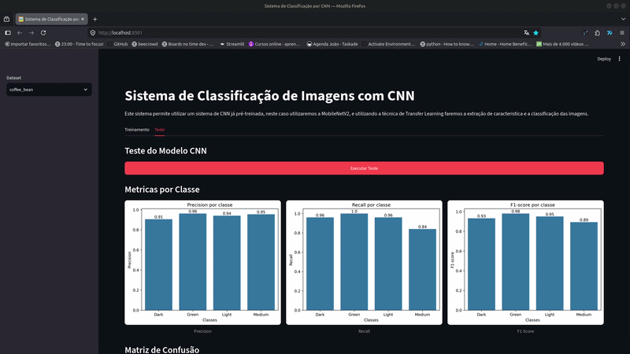

# ☕ Classificação de Grãos de Café utilizando CNN e Transfer Learning

## 📌 Sobre o projeto

Este projeto implementa um sistema de classificação de imagens utilizando **Redes Neurais Convolucionais (CNN)** e a técnica de **Transfer Learning**.

O objetivo é classificar imagens de grãos de café em diferentes categorias utilizando uma rede neural pré-treinada, a **MobileNetV2**, adaptada para uma nova tarefa de classificação.

A aplicação possui uma interface desenvolvida em **Streamlit**, permitindo:

- Seleção do dataset;
- Treinamento do modelo CNN;
- Visualização da arquitetura da rede;
- Acompanhamento das métricas de treinamento;
- Avaliação do modelo em dados de teste;
- Visualização de métricas de classificação e matriz de confusão.








---

# 🎯 Objetivo

Construir um pipeline completo de classificação de imagens contendo:

- Preparação do dataset;
- Carregamento das imagens;
- Data augmentation;
- Treinamento utilizando CNN;
- Avaliação do modelo;
- Geração de métricas;
- Interface interativa para utilização do modelo.

---

# 🧠 Modelo utilizado

O modelo base utilizado foi a:

## MobileNetV2

A MobileNetV2 foi treinada originalmente no dataset ImageNet e utilizada como extratora de características.

A arquitetura utilizada:

**Entrada:** 224x224x3

**MobileNetV2:** (include_top=False)

**Batch Normalization**

**Global Average Pooling**

**Dropout**

**Dense (64 neurônios)**

**Dropout**

**Camada de saída Softmax**

**Número de classes:** 4 classes

**Classes:**

* Dark
* Green
* Light
* Medium

---

# 📂 Estrutura do projeto

```
classificacao_cnn/
│
├── main.py							# Arquivo principal apra execução do projeto
├── README.md
├── LICENSE
├── requirements.txt
│
├── modulos/
│   ├── classificadores/
│   └── utils/
│
├── datasets/
│   └── coffee_bean/
│       └── fonte_do_dataset.txt
│
├── modelos/
│   └── README.md
│
├── log/
│   └── README.md
│
├── resultados/
│   └── README.md
│
└── .gitignore
```

---

# 📊 Dataset

Dataset utilizado:

**Coffee Bean Dataset Resized 224x224**

Fonte:

https://www.kaggle.com/datasets/gpiosenka/coffee-bean-dataset-resized-224-x-224

O dataset possui imagens classificadas em quatro categorias:

| Classe | Descrição             |
| ------ | ----------------------- |
| Dark   | Grãos torrados escuros |
| Green  | Grãos verdes           |
| Light  | Grãos de torra clara   |
| Medium | Grãos de torra média  |

---

# ⚙️ Tecnologias utilizadas

## Linguagem

- Python 3.10

## Deep Learning

- TensorFlow
- Keras
- MobileNetV2

## Processamento de dados

- NumPy
- Pandas
- Scikit-learn

## Visualização

- Matplotlib
- Seaborn

## Interface

- Streamlit

---

# 📦 Instalação

Clone o repositório:

```Shell
git clone https://github.com/Joao-gui/classificacao_cnn.git
```

Entre na pasta do projeto:

```Shell
cd classificacao_cnn
```

Crie o ambiente:

```Shell
conda create -n classificacao_cnn python=3.10
```

Ative:

```Shell
conda activate classificacao_cnn
```

instale as dependências:

```Shell
pip install -r requirements.txt
```

---

# ▶️ Executando o projeto

Execute:

```Shell
streamlit run main.py
```

A aplicação será aberta no navegador.

---

# 🏋️ Treinamento do modelo

Na aba **Trenamento** é possivel configurar:

* Batch size;
* Número de épocas;

O pipeline realiza:

1. Carregamento das imagens;
2. Aplicação de data augmentation;
3. Criação da arquitetura CNN;
4. Compilação do modelo;
5. Treinamento;
6. Salvamaneto dos melhores pesos;
7. Exportação do modelo final.

Durante o treinamento são gerados:

* Histórico de acurácia;
* Histórico de loss;
* Arquivo de log;
* Checkpoints

---

# 🧪 Avaliação do modelo

Na aba **Teste,** o modelo treinado é carregado e avaliado.

São gerados:

## Acuracy

Mede a porcentagemk de classificações corretas.

## Classification Report

Com:

* Precision;
* Recall;
* F1-Score.

## Matriz de Confusão

Premite analisar os erros entre as classes.

---

# 👨‍💻 Autor

João Guilherme - Desenvolvedor IA -  [github.com/Joao-gui](https://github.com/Joao-gui?)

⭐ Se este projeto foi útil para você, considere dar uma estrela! ⭐
